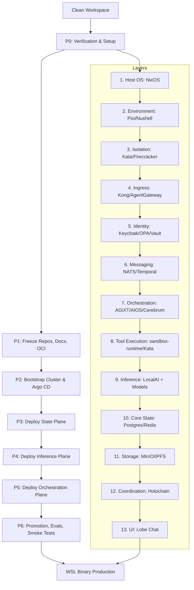

# BUILDKIT_STARTER_SPEC — Single Source of Truth (SSoT)

**Purpose:** This document is the current **authoritative stack map** for our full-autonomous operations system. This BuildKit is an **expanded specification** that guides **AI-driven stitching** of multiple repositories into a comprehensive agentic OS to produce a **single binary** for WSL2/Holochain on Windows. It provides direction and tools for repo integration, not a build system itself.
**Human interaction model:** **UI-only (“vibe coding”)** — developers/users do *not* SSH into boxes or manually operate services.
**Anti-drift rule:** Any change to the stack must update **this file first** (or in the same PR).

## Table of Contents - GitHub Repositories

### Host OS & Environment
- [NixOS/nixpkgs](https://github.com/NixOS/nixpkgs) - Reproducible host baseline
- [prefix-dev/pixi](https://github.com/prefix-dev/pixi) - Multi-tool environment + task runner
- [nushell/nushell](https://github.com/nushell/nushell) - Default shell

### Isolation & Runtime
- [anthropic-experimental/sandbox-runtime](https://github.com/anthropic-experimental/sandbox-runtime) - Process sandbox
- [kata-containers/kata-containers](https://github.com/kata-containers/kata-containers) - Default isolation
- [firecracker-microvm/firecracker](https://github.com/firecracker-microvm/firecracker) - MicroVM pools

### Cluster & Delivery
- [argoproj/argo-cd](https://github.com/argoproj/argo-cd) - GitOps deploy
- [argoproj/argo-rollouts](https://github.com/argoproj/argo-rollouts) - Canary/blue-green
- [argoproj/argo-workflows](https://github.com/argoproj/argo-workflows) - DAG workflows

### Edge & Agent Traffic
- [Kong/kong](https://github.com/Kong/kong) - North-South edge ingress
- [agentgateway/agentgateway](https://github.com/agentgateway/agentgateway) - Agent/MCP traffic plane

### Identity & Policy
- [keycloak/keycloak](https://github.com/keycloak/keycloak) - OIDC identity
- [open-policy-agent/opa](https://github.com/open-policy-agent/opa) - Policy-as-code
- [hashicorp/vault](https://github.com/hashicorp/vault) - Secrets management
- [smallstep/cli](https://github.com/smallstep/cli) - PKI automation
- [dani-garcia/vaultwarden](https://github.com/dani-garcia/vaultwarden) - Bitwarden-compatible vault

### Messaging & Orchestration
- [nats-io/nats-server](https://github.com/nats-io/nats-server) - Event bus
- [temporalio/temporal](https://github.com/temporalio/temporal) - Durable workflows
- [n8n-io/n8n](https://github.com/n8n-io/n8n) - Connector automation

### Agent Runtime
- [agiresearch/AIOS](https://github.com/agiresearch/AIOS) - Agent substrate/syscalls
- [agiresearch/Cerebrum](https://github.com/agiresearch/Cerebrum) - Agent SDK
- [Josh-XT/AGiXT](https://github.com/Josh-XT/AGiXT) - Orchestration platform
- [agno-agi/agno](https://github.com/agno-agi/agno) - Agent framework
- [ruvnet/agentic-flow](https://github.com/ruvnet/agentic-flow) - Dev to deploy flow
- [ruvnet/claude-flow](https://github.com/ruvnet/claude-flow) - Swarm orchestration
- [ruvnet/Synaptic-Mesh](https://github.com/ruvnet/Synaptic-Mesh) - Distributed agent mesh
- [ruvnet/daa](https://github.com/ruvnet/daa) - Agent coordination
- [smallcloudai/refact](https://github.com/smallcloudai/refact) - Coding agent
- [arkflow-rs/arkflow](https://github.com/arkflow-rs/arkflow) - Rust orchestration

### Tool Execution
- [googleapis/genai-toolbox](https://github.com/googleapis/genai-toolbox) - Tool wrappers
- [FlexNetOS/remote-agentic-coding-system](https://github.com/FlexNetOS/remote-agentic-coding-system) - Remote coding
- [ruvnet/midstream](https://github.com/ruvnet/midstream) - Streaming analysis
- [ruvnet/ruv-FANN](https://github.com/ruvnet/ruv-FANN) - NN utility
- [ruvnet/sublinear-time-solver](https://github.com/ruvnet/sublinear-time-solver) - Solver tool

### Inference
- [mudler/LocalAI](https://github.com/mudler/LocalAI) - OpenAI-compatible serving

### State & Storage
- [postgres/postgres](https://github.com/postgres/postgres) - System-of-record
- [redis/redis](https://github.com/redis/redis) - Cache
- [minio/minio](https://github.com/minio/minio) - Object store
- [ipfs/kubo](https://github.com/ipfs/kubo) - Content-addressed storage
- [holochain/holochain](https://github.com/holochain/holochain) - P2P coordination
- [holochain/lair](https://github.com/holochain/lair) - Secure keystore

### Data & Query
- [mindsdb/mindsdb](https://github.com/mindsdb/mindsdb) - AI query layer
- [apache/datafusion](https://github.com/apache/datafusion) - Analytics engine

### LLMOps & Evaluation
- [promptfoo/promptfoo](https://github.com/promptfoo/promptfoo) - Prompt regression tests
- [truera/trulens](https://github.com/truera/trulens) - Runtime evaluation
- [tensorzero/tensorzero](https://github.com/tensorzero/tensorzero) - LLMOps gateway

### Training
- [mlflow/mlflow](https://github.com/mlflow/mlflow) - Experiment tracking
- [unslothai/unsloth](https://github.com/unslothai/unsloth) - Finetuning acceleration

### UI
- [lobehub/lobe-chat](https://github.com/lobehub/lobe-chat) - Primary operator UI
- [firecrawl/open-lovable](https://github.com/firecrawl/open-lovable) - UI/codegen tool
- [pixijs/pixijs](https://github.com/pixijs/pixijs) - 2D WebGL rendering library

### Build Tools (JavaScript/TypeScript)
- [swc-project/swc](https://github.com/swc-project/swc) - Fast Rust-based JS/TS compiler (20x faster than Babel)
- [evanw/esbuild](https://github.com/evanw/esbuild) - Extremely fast JS bundler and minifier

### Notebooks
- [jupyterlab/jupyterlab](https://github.com/jupyterlab/jupyterlab) - Notebooks

### Observability
- [prometheus/prometheus](https://github.com/prometheus/prometheus) - Metrics
- [grafana/grafana](https://github.com/grafana/grafana) - Dashboards
- [grafana/loki](https://github.com/grafana/loki) - Logs
- [netdata/netdata](https://github.com/netdata/netdata) - Real-time monitoring
- [umami-software/umami](https://github.com/umami-software/umami) - Product analytics

### Security
- [aquasecurity/trivy](https://github.com/aquasecurity/trivy) - Vulnerability scanning
- [anchore/syft](https://github.com/anchore/syft) - SBOM generation
- [anchore/grype](https://github.com/anchore/grype) - Vuln scan from SBOM
- [sigstore/cosign](https://github.com/sigstore/cosign) - Sign/verify images

### DevOps & Autonomy
- [agenticsorg/devops](https://github.com/agenticsorg/devops) - Agentic ops
- [agenticsorg/quantum-agentics](https://github.com/agenticsorg/quantum-agentics) - R&D

### Additional Tools
- [sqlite/sqlite](https://github.com/sqlite/sqlite) - Local durability
- [neondatabase/neon](https://github.com/neondatabase/neon) - Preview DBs
- [bytebase/bytebase](https://github.com/bytebase/bytebase) - DB CI/CD
- [vcache-project/vCache](https://github.com/vcache-project/vCache) - Prompt cache
- [messkan/prompt-cache](https://github.com/messkan/prompt-cache) - Prompt caching
- [ruvnet/ruvector](https://github.com/ruvnet/ruvector) - Vector memory
- [opentelemetry-collector](https://github.com/open-telemetry/opentelemetry-collector) - Instrumentation
- [containerd/containerd](https://github.com/containerd/containerd) - Container runtime
- [runc](https://github.com/opencontainers/runc) - OCI runtime
- [helm](https://github.com/helm/helm) - Charts
- [kubectl](https://github.com/kubernetes/kubectl) - Kubernetes CLI
- [kustomize](https://github.com/kubernetes-sigs/kustomize) - Overlays
- [neovim](https://github.com/neovim/neovim) - Editor
- [git](https://github.com/git/git) - VCS
- [jj-vcs/jj](https://github.com/jj-vcs/jj) - VCS ergonomics
- [curl](https://github.com/curl/curl) - HTTP client
- [jq](https://github.com/jqlang/jq) - JSON processor
- [yq](https://github.com/mikefarah/yq) - YAML processor

---

## 0. Top-level design RULES (anti-drift)

1. **One primary UI** (operators live here).
2. **One inference plane** (all model calls go through it unless explicitly exempted).
3. **North–South edge gateway** is **separate** from **Agent/MCP gateway**.
4. **Policy gates everything** (tools, data, deployments, promotions).
5. **Promotion is automated** (Dev → QA → Staging → Prod) and **quality-gated**.
6. **Isolation is a knob** (cheap sandbox → default VM-container → microVM pool).
7. **State is explicit** (system-of-record + cache + vectors + artifacts; nothing “mystical”).
8. **Observability is mandatory** (traces/metrics/logs; can’t debug what you can’t see).
9. **Autonomy must be testable** (eval harness + regression suites; no “it feels better”).
10. **Avoid overlap**: If two components compete for the same responsibility, one must become *primary* or be removed.
11. **Cloud-first build**: All artifacts must be buildable in ephemeral cloud environments (Manus AI, GitHub Actions, etc.).
12. **Holochain-native coordination**: Agent state lives in DHT, not central DB (Postgres is backup/audit only).
13. **Cross-platform parity**: macOS and Linux (WSL2) must be first-class targets; Windows native runs via WSL2.
14. **Single-binary distribution**: Core bootstrapper compiles to one static binary per platform—no runtime deps.

---

## 1. Layer map (end-to-end)

> Legend: **Primary** = in-path default. **Primary** = only if needed / later.
> “Repo” links are the repos we explicitly selected or evaluated in-chat.

### 1.1 Hardware
- **Primary:** Physical nodes (CPU/GPU), storage, network.

### 1.2 Host OS (baseline)
- **Primary:** **[NixOS/nixpkgs](https://github.com/NixOS/nixpkgs)** — reproducible host baseline, rollback stability. (NixOS is the Linux foundation we are using.)

### 1.3 Dev/runtime environment + shell
- **Primary:** **[prefix-dev/pixi](https://github.com/prefix-dev/pixi)** — multi-tool environment + task runner (polyglot).
- **Primary:** **[nushell/nushell](https://github.com/nushell/nushell)** — default shell.

### 1.4 Isolation & sandboxing (portability + stability knobs)
**Execution containment ladder (use the lightest that meets risk):**
1) **Primary:** **[anthropic-experimental/sandbox-runtime](https://github.com/anthropic-experimental/sandbox-runtime)** — MCP/tool process sandbox (tight FS/net).
2) **Primary:** **Kata Containers** — default isolation for services/tools (VM-backed containers).
3) **Primary:** **Firecracker** — burst / high-risk / per-run microVM pools.

### 1.5 Cluster substrate
- **Primary:** Kubernetes (or k3s) as the scheduling substrate (implied by Argo stack).

### 1.6 Delivery + environment promotion (Dev → QA → Staging → Prod)
- **Primary:** **[argoproj/argo-cd](https://github.com/argoproj/argo-cd)** — GitOps deploy/reconcile.
- **Primary:** **[argoproj/argo-rollouts](https://github.com/argoproj/argo-rollouts)** — canary/blue-green + metric-gated promotion/rollback.
- **Primary:** **[argoproj/argo-workflows](https://github.com/argoproj/argo-workflows)** — batch/DAG workflows inside the cluster.
- **Primary:** **[bytebase/bytebase](https://github.com/bytebase/bytebase)** — DB CI/CD across environments.
- **Primary:** **[neondatabase/neon](https://github.com/neondatabase/neon)** — preview/branch DB workflows (great for PR environments).

### 1.7 Edge ingress + agent traffic plane (keep both)
- **Primary (North–South edge):** **[Kong/kong](https://github.com/Kong/kong)** — external ingress, routing, rate limits, auth hooks.
- **Primary (Agent/MCP plane):** **[agentgateway/agentgateway](https://github.com/agentgateway/agentgateway)** — agent↔tool / MCP routing & governance.

**Division of responsibility (avoid overlap):**
- Kong = Internet/API edge (“front door”).
- AgentGateway = agent-aware traffic plane for tools/MCP (“inside the building”).

### 1.8 Identity, policy, secrets (hard gates)
- **Primary:** **[keycloak/keycloak](https://github.com/keycloak/keycloak)** — identity/OIDC.
- **Primary:** **[open-policy-agent/opa](https://github.com/open-policy-agent/opa)** — policy-as-code decisions (tools/data/promotion gates).
- **Primary:** **[hashicorp/vault](https://github.com/hashicorp/vault)** — secrets management + dynamic credentials.
- **Primary:** **[smallstep/cli](https://github.com/smallstep/cli)** — PKI automation (mTLS).
- **Primary:** **[dani-garcia/vaultwarden](https://github.com/dani-garcia/vaultwarden)** — Bitwarden-compatible password vault (human secrets + device creds; complements Vault).

### 1.9 Messaging + durable orchestration (autonomy backbone)
- **Primary:** **[nats-io/nats-server](https://github.com/nats-io/nats-server)** — event bus.
- **Primary:** **[temporalio/temporal](https://github.com/temporalio/temporal)** — durable workflows (retries, timers, state history).
- **Primary:** **[n8n-io/n8n](https://github.com/n8n-io/n8n)** — connector-heavy automation (only if needed; keep Temporal for correctness).

### 1.10 Agent runtime / agent OS layer (brains)
We prevent “platform overlap” by assigning roles:

- **Primary (agent substrate/syscalls):** **[agiresearch/AIOS](https://github.com/agiresearch/AIOS)** — user-space agent kernel.
- **Primary (agent SDK):** **[agiresearch/Cerebrum](https://github.com/agiresearch/Cerebrum)** — SDK that talks to AIOS.
- **Primary (ops/control plane):** **[Josh-XT/AGiXT](https://github.com/Josh-XT/AGiXT)** — orchestration platform (chains/workflows + extensions/connectors + memory + multi-agent control).
- **Primary (agent dev framework):** **[agno-agi/agno](https://github.com/agno-agi/agno)** — clean framework for building agents/tools.
- **Primary (agent dev → deploy flow):** **[ruvnet/agentic-flow](https://github.com/ruvnet/agentic-flow)** — switch models in Claude Code/Agent SDK; then deploy hosted agents.
- **Primary (local swarm orchestration):** **[ruvnet/claude-flow](https://github.com/ruvnet/claude-flow)** — orchestration for Claude-style agent swarms (often paired with MCP).
- **Primary (coordination/mesh):** **[ruvnet/Synaptic-Mesh](https://github.com/ruvnet/Synaptic-Mesh)**, **[ruvnet/daa](https://github.com/ruvnet/daa)** — distributed agent mesh/coordination.
- **Primary (end-to-end coding agent alternative):** **[smallcloudai/refact](https://github.com/smallcloudai/refact)** — self-hostable software-dev agent (overlaps with AGiXT; only adopt if it replaces something).
- **Primary (Rust orchestration runtime):** **[arkflow-rs/arkflow](https://github.com/arkflow-rs/arkflow)**.

### 1.11 Tool execution plane (what agents actually run)
- **Primary:** sandbox-runtime (tight per-tool sandbox).
- **Primary:** Kata (default tool/service execution boundary).
- **Primary:** Firecracker (untrusted/high-risk per-run execution pool).
- **Primary:** **[googleapis/genai-toolbox](https://github.com/googleapis/genai-toolbox)** (tool wrappers/utilities).
- **Primary:** **[FlexNetOS/remote-agentic-coding-system](https://github.com/FlexNetOS/remote-agentic-coding-system)** (remote coding operator/bridge).

- **Primary:** **[ruvnet/midstream](https://github.com/ruvnet/midstream)** — streaming-response analysis middleware (token/segment-level introspection).
- **Primary:** **[ruvnet/ruv-FANN](https://github.com/ruvnet/ruv-FANN)** — fast Rust NN utility lib (small models / forecasting / heuristics inside tools).
- **Primary:** **[ruvnet/sublinear-time-solver](https://github.com/ruvnet/sublinear-time-solver)** — sublinear solver exposed as CLI/MCP tool (math/optimization primitives).

**Tool sharing rule:** all models (Codex/Claude/local SLMs) call tools through **AgentGateway (MCP)** so tooling is a single governed surface (authZ via OPA, secrets via Vault, audits to Postgres).

### 1.12 Inference plane (models)
- **Primary:** **[mudler/LocalAI](https://github.com/mudler/LocalAI)** — single OpenAI-compatible serving plane (local models + adapters).
- **AGiXT Integration:** AGiXT orchestrates multi-provider inference via LocalAI, supporting local models and approved cloud providers (Claude Code CLI, Codex CLI, etc.). Future support planned for Candle and Candle-VLLM backends.
- **Required policy (autonomous DevOps):** run **multi-model fan-out (“MOE”)** for *every* change-making task:
  - **Local tier:** ≥ **5** small local models (target <3B active params) via **llama.cpp** backends.
  - **Cloud tier:** ≥ **2** strong cloud coders/reasoners in parallel (e.g., Claude Code + Codex).
  - **Reducer:** deterministic merge + policy gate (OPA) + eval gate (promptfoo/TruLens).
- **Standalone llama.cpp:** allowed as an *execution backend* (especially to host many small models cheaply), but keep the API surface unified through LocalAI.

**Approved Providers (HTTP OAuth / CLI):**
- **Claude Code CLI**
- **Codex CLI**
- **GitHub Copilot CLI**
- **Abacus AI CLI**
- **OpenRouter API**

**Approved Local Models (Unsloth/GGUF):**
- **[gemma-3n-E2B-it](https://huggingface.co/unsloth/gemma-3n-E2B-it-GGUF?show_file_info=gemma-3n-E2B-it-UD-Q4_K_XL.gguf)** (`gemma-3n-E2B-it-UD-Q4_K_XL.gguf`)
- **[Phi-4-mini-reasoning](https://huggingface.co/unsloth/Phi-4-mini-reasoning-GGUF?show_file_info=Phi-4-mini-reasoning-UD-Q4_K_XL.gguf)** (`Phi-4-mini-reasoning-UD-Q4_K_XL.gguf`)
- **[DeepSeek-R1-Distill-Qwen-1.5B](https://huggingface.co/unsloth/DeepSeek-R1-Distill-Qwen-1.5B-GGUF?show_file_info=DeepSeek-R1-Distill-Qwen-1.5B-Q8_0.gguf)** (`DeepSeek-R1-Distill-Qwen-1.5B-Q8_0.gguf`)
- **[gemma-3-4b-it-qat](https://huggingface.co/unsloth/gemma-3-4b-it-qat-GGUF?show_file_info=gemma-3-4b-it-qat-UD-Q4_K_XL.gguf)** (`gemma-3-4b-it-qat-UD-Q4_K_XL.gguf`)
- **[gemma-3-1b-it](https://huggingface.co/unsloth/gemma-3-1b-it-GGUF?show_file_info=gemma-3-1b-it-BF16.gguf)** (`gemma-3-1b-it-BF16.gguf`)
- **[Qwen3-0.6B](https://huggingface.co/unsloth/Qwen3-0.6B-GGUF?show_file_info=Qwen3-0.6B-BF16.gguf)** (`Qwen3-0.6B-BF16.gguf`)
- **[Qwen3-4B](https://huggingface.co/unsloth/Qwen3-4B-GGUF?show_file_info=Qwen3-4B-Q4_K_M.gguf)** (`Qwen3-4B-Q4_K_M.gguf`)

### 1.13 Core state: DB + cache + vectors + artifacts
- **Primary:** **[postgres/postgres](https://github.com/postgres/postgres)** — system-of-record (agents, runs, audit, configs).
- **Primary:** **[sqlite/sqlite](https://github.com/sqlite/sqlite)** — local/offline per-node durability.
- **Primary:** **[redis/redis](https://github.com/redis/redis)** — cache (sessions, rate-limit counters, hot responses).

**Prompt cache policy (on Redis):**
- **Primary:** **[vcache-project/vCache](https://github.com/vcache-project/vCache)** — caching layer.
- **Primary:** **[messkan/prompt-cache](https://github.com/messkan/prompt-cache)** — prompt caching utility.

**Vector / embedding memory store:**
- **Primary:** **[ruvnet/ruvector](https://github.com/ruvnet/ruvector)** — vectors + semantic recall + memory indexes.

### 1.14 Artifacts + provenance + distribution
- **Primary:** **[minio/minio](https://github.com/minio/minio)** *or* **[rustfs/rustfs](https://github.com/rustfs/rustfs)** — S3-compatible artifact/object store (datasets, models, logs, bundles).
- **Primary:** **[ipfs/kubo](https://github.com/ipfs/kubo)** — content-addressed packaging for integrity + distribution.
- **Primary (mandatory, coordination backbone):** **[holochain/holochain](https://github.com/holochain/holochain)** — agent-centric P2P framework for distributed state, identity, and coordination. **This is the backbone of the agentic OS; all agent-to-agent communication routes through Holochain DHT.** Enables parallel distributed compute, inference, storage, and memory across heterogeneous hardware without central server dependency.
  - **Required binaries:** `holochain` (conductor), `hc` (CLI), `lair-keystore` (secure key management)
  - **Platform support:** Linux (native + WSL2) ✅, macOS ✅, Windows native ❌ (use WSL2)

### 1.15 Data access + query acceleration (primary)
- **Primary:** **[mindsdb/mindsdb](https://github.com/mindsdb/mindsdb)** — AI query layer over data sources.
- **Primary:** **[apache/datafusion](https://github.com/apache/datafusion)** — Rust analytics engine.
- **Primary:** **[neo4j-labs](https://github.com/neo4j-labs)** — graph DB experiments.

### 1.16 LLMOps: evaluation harness + experiments + drift control
Quality gates belong here. Pick a center of gravity.

- **Primary recommendation:** **[tensorzero/tensorzero](https://github.com/tensorzero/tensorzero)** — LLMOps gateway-ish layer (evals/experiments/telemetry control).
- **Eval harness (use both; different jobs):**
  - **[promptfoo/promptfoo](https://github.com/promptfoo/promptfoo)** — prompt regression tests + red-team/guardrail checks + CI gating.
  - **[truera/trulens](https://github.com/truera/trulens)** — runtime evaluation, tracing, and feedback loops for LLM apps/agents.
- **Primary / legacy:** **[openai/evals](https://github.com/openai/evals)** and/or OpenAI’s Evals API — only if you need ecosystem alignment with OpenAI-native eval workflows.

### 1.17 Training + model lifecycle
- **Primary:** **[mlflow/mlflow](https://github.com/mlflow/mlflow)** — experiment tracking + registry.
- **Primary:** **[unslothai/unsloth](https://github.com/unslothai/unsloth)** — finetuning acceleration.
- **Primary:** **[silentfortin/sentiment-monitoring-mlops](https://github.com/silentfortin/sentiment-monitoring-mlops)** — reference patterns (not core platform).

### 1.18 Observability + security + product analytics
- **Primary:** **[open-telemetry/opentelemetry-specification](https://github.com/open-telemetry/opentelemetry-specification)** — instrumentation standard (traces/metrics/log correlation).
- **Primary:** **[prometheus/prometheus](https://github.com/prometheus/prometheus)** — metrics store/alerts.
- **Primary:** **[netdata/netdata](https://github.com/netdata/netdata)** — real-time infra monitoring.
- **Primary:** **[aquasecurity/trivy](https://github.com/aquasecurity/trivy)** — vuln/misconfig/SBOM scanning gates.
- **Primary:** **[umami-software/umami](https://github.com/umami-software/umami)** — product analytics (UI usage).

### 1.19 Autonomous DevOps & remediation
- **Primary:** **[agenticsorg/devops](https://github.com/agenticsorg/devops)** — agentic ops automation layer.
- **Primary:** **[agenticsorg/quantum-agentics](https://github.com/agenticsorg/quantum-agentics)** — R&D (keep quarantined until proven).

### 1.20 UI (human-only touchpoint)
- **Primary:** **[lobehub/lobe-chat](https://github.com/lobehub/lobe-chat)** — primary operator UI/workspace.
- **Primary:** **[firecrawl/open-lovable](https://github.com/firecrawl/open-lovable)** — UI/codegen tool inside tool plane (must be gated by eval + PR checks).
- **Primary:** **[pixijs/pixijs](https://github.com/pixijs/pixijs)** — 2D WebGL rendering library for graphics, games, and data visualization.

### 1.21 JavaScript/TypeScript Build Tools (frontend compilation)
- **Primary:** **[swc-project/swc](https://github.com/swc-project/swc)** — fast Rust-based JS/TS compiler (20x faster than Babel). Transpiles TypeScript/modern JS to browser-compatible code.
- **Primary:** **[evanw/esbuild](https://github.com/evanw/esbuild)** — extremely fast JS bundler and minifier. Use for production builds and dev server.

**Division of responsibility:**
- **SWC** = TypeScript/JSX compilation, syntax transforms (build-time)
- **esbuild** = bundling, minification, tree-shaking (build-time)
- **PixiJS** = 2D rendering engine (runtime)

### 1.22 Notebooks + testing (required for autonomy)
- **Primary:** **[jupyterlab/jupyterlab](https://github.com/jupyterlab/jupyterlab)** — notebooks in Pixi-managed environments.

**Testing layers (minimum viable):**
- Unit tests (per language)
- Integration tests (gateways → agent runtime → tools → DB/vector/object store)
- E2E tests (UI + agent actions)
- Load tests (service capacity + queue behavior)
- Security gates (Trivy)
- Agent eval tests (promptfoo/TruLens/TensorZero)
- Promotion gates (Argo Rollouts + Prometheus/SLO checks)

---

## 2. Environment promotion wiring (Dev / QA / Staging / Prod)

**Mechanism:**
- **Argo CD** deploys environment overlays from Git.
- **Argo Rollouts** performs controlled releases and auto rollback based on metrics.
- **OPA** enforces: “no promotion unless tests+evals+security pass”.

**Gates (must-pass):**
1) Build + unit tests
2) Integration tests
3) Security scans (Trivy)
4) Policy checks (OPA)
5) Agent eval suite (promptfoo/TruLens/TensorZero)
6) Canary metrics healthy (Prometheus / Rollouts analysis)

---

## 3. Drift control checklists

### 3.1 “Do we already have this capability?”
Before adding a new repo/service, answer:
- Which layer does it belong to?
- Does anything already own that responsibility?
- Is it a replacement, or a primary plugin?
- What new failure modes does it introduce?
- What is the rollback plan?

### 3.2 Single-source-of-truth pointers
- **Infra truth:** Git + Argo CD.
- **Policy truth:** OPA bundles in Git.
- **Secrets truth:** Vault (never Git).
- **Run truth:** Postgres (system-of-record) + traces/metrics.
- **Artifacts truth:** MinIO + content-addressed copy in IPFS.

---

## 4. Open decisions (explicit)

1) **Prompt DSL / prompt toolchain** candidates:
   - [automl/promptolution](https://github.com/automl/promptolution)
   - [BoundaryML/baml](https://github.com/BoundaryML/baml)
   - [microsoft/prompty](https://github.com/microsoft/prompty)

2) **Memory augmentation** candidates (only if they beat Postgres+ruvector):
   - [memodb-io/memobase](https://github.com/memodb-io/memobase)
   - [MemoriLabs/Memori](https://github.com/MemoriLabs/Memori)
   - [FrankvdStam/mem-rs](https://github.com/FrankvdStam/mem-rs)
   - [usememos/memos](https://github.com/usememos/memos)
   - [AppFlowy-IO/AppFlowy-Cloud](https://github.com/AppFlowy-IO/AppFlowy-Cloud)

3) **DB variants / future-scale** candidates:
   - [neondatabase/neon](https://github.com/neondatabase/neon) (preview DBs)
   - rust-postgres (client/lib)
   - [neo4j-labs](https://github.com/neo4j-labs) (graph)

4) **Developer workflow tooling** candidates:
   - [jj-vcs/jj](https://github.com/jj-vcs/jj) (VCS ergonomics)

---

## 5. One-line execution flow (reference)

**UI (Lobe Chat)** → **Kong (edge)** → **AgentGateway (agent/tool plane)** → **AGiXT + AIOS/Cerebrum (agent runtime)** →
tools execute in **sandbox-runtime / Kata / Firecracker**, model calls via **LocalAI**, state in **Postgres/SQLite/Redis**, memory in **ruvector**, artifacts in **MinIO/IPFS**,
quality enforced by **Trivy + eval harness**, promotion by **Argo CD/Rollouts**, telemetry via **OpenTelemetry/Prometheus/Netdata**, governed by **Keycloak/OPA/Vault**.

---

## 6. Cloud Build Execution (Agentic CI/CD)

### 6.1 Agentic Build Orchestrator Interface

**Goal:** Enable cloud-native agents (Manus AI, Claude Code, Codex) to invoke BuildKit remotely and produce deterministic artifacts.

**Interface contract:**
- **Trigger:** MCP tool call or REST webhook with manifest hash
- **Inputs:** `manifests/` directory (hash-locked), build phase target
- **Outputs:**
  - Single signed bootstrap binary per target in `artifacts/` (e.g., `ripple-bootstrap-<target>.exe|bin`)
  - SBOM (syft-generated)
  - Provenance attestation (cosign-signed)
  - Build log + metrics (OTel trace)

**Execution modes:**

| Mode | Description | Use case |
|------|-------------|----------|
| `cloud-ephemeral` | Manus/cloud spawns ephemeral builder VM | Default for CI |
| `cloud-persistent` | Dedicated builder pool with warm cache | High-frequency builds |
| `local-containerized` | Docker/Podman on dev machine | Local testing |
| `wsl2-native` | Inside WSL2 distro itself | Bootstrapping upgrades |

### 6.2 Cloud Builder Requirements

- **Base image:** NixOS-based builder (determinism guaranteed)
- **Cache layer:** IPFS/S3 artifact cache (content-addressed)
- **Coordination:** Holochain DHT sync for distributed build state
- **Auth:** mTLS via Vault-issued short-lived certs
- **Isolation:** Firecracker microVM per build (untrusted input protection)

### 6.3 Build Artifact Publishing

**Multi-destination publish (all builds):**

| Destination | Purpose | Retention |
|-------------|---------|----------|
| IPFS (Kubo) | Immutable content-addressed storage | Permanent |
| S3 (MinIO/RustFS) | Fast regional download | 90 days |
| Holochain DHT | Discovery + integrity verification | Permanent |
| GitHub Releases | Public distribution | Tagged releases only |

### 6.4 Manus AI Integration Spec

**Manus agent capabilities required:**
- Execute Nix builds in ephemeral containers
- Access pinned artifact URLs (no network drift)
- Sign artifacts with org-managed keys (Vault integration)
- Publish to IPFS gateway + S3 bucket
- Report build telemetry to OTel collector

**MCP tool for Manus invocation:**
```json
{
  "name": "buildkit.cloud_build",
  "description": "Trigger cloud build of Ripple bootstrap binary",
  "inputs": {
    "target": {"type": "string", "enum": ["x86_64-pc-windows-msvc", "x86_64-unknown-linux-musl", "aarch64-unknown-linux-musl", "x86_64-apple-darwin", "aarch64-apple-darwin"]},
    "manifest_hash": {"type": "string", "description": "SHA256 of manifests/ directory"},
    "embed_rootfs": {"type": "boolean", "default": false},
    "sign": {"type": "boolean", "default": true}
  },
  "outputs": {
    "binary_url": "string",
    "ipfs_cid": "string",
    "sbom_url": "string",
    "provenance_url": "string",
    "build_trace_id": "string"
  }
}
```

---

## 7. Buildkit & Bootstrapping Specifications

### 7.1 OCI image lists (split and merged)

**Inputs:**
- `tables/oci_images_base.csv` — primary OCI images for infra/app stack (authoritative when present)
- `tables/oci_images_smoke.csv` — **required** OCI images for smoke tests (must always be present)
- `tables/oci_images.csv` — merged output (do not hand-edit unless you mean “legacy override”)

**Merge:**
- Script: `scripts/oci/merge_oci_images.nu`
- Output: `tables/oci_images.csv`
- De-dup key: `name`
- Precedence: **base > legacy > smoke**

**Tasks:**
- `task-P1-merge-oci-images` produces the merged table
- `task-P1-oci-freeze-real` depends on `task-P1-merge-oci-images`

**Rationale:**
Smoke test images are non-negotiable. Keeping them in a separate file prevents accidental removal when the base image list is edited, while still producing a single authoritative merged list for OCI freezing.

### 7.2 WSL2 Distro Bootstrapper (single binary)

**Goal:** Produce **one signed Windows binary** (`.exe`) that can create/update a deterministic WSL2 distro for this stack.

**Outputs:**
- `ripple_wsl` distro (name configurable) imported via `wsl.exe --import`
- Deterministic base user + home layout
- Stack toolchain installed and verified
- Logs written to a stable location on the Windows host and inside the distro

**Inputs (versioned + hash-locked):**
- `manifests/wsl2/distro.json` (name, default user, distro version, required packages)
- `manifests/wsl2/assets.json` (artifact URLs + sha256, for offline mirroring)
- Root filesystem artifact:
  - Option A (preferred): **NixOS-WSL rootfs** (pinned by hash)
  - Option B: minimal Debian/Ubuntu rootfs (only if you accept drift risk)

**Bootstrapper behavior (must):**
1) Preflight checks: Windows version, `wsl.exe` exists, virtualization enabled.
2) Acquire rootfs: Load from disk (`--assets-dir`) or download from pinned URL; verify sha256.
3) Import: `wsl.exe --import <distroName> <installDir> <rootfs.tar>`
4) Provision inside distro: create default user, install pinned packages/tooling, write config (including Neovim baseline).
5) Verify: run “smoke” commands (nu, git, nvim, task runner), emit `reports/wsl2_bootstrap.json`.

**Acceptance tests:**
- Fresh machine: Binary yields working distro + passes smoke tests.
- Existing machine: Binary upgrades/repairs + passes smoke tests.
- Offline mode: Completes with `--assets-dir` without network.

### 7.3 Neovim requirement

**Requirement:** Neovim is a **required** tool in the base stack.
- Binary: `nvim`
- Config: `$XDG_CONFIG_HOME/nvim` (default `~/.config/nvim`)

**Distribution policy (offline-first):**
- Baseline config is shipped as part of the stack assets (repo-vendored or Nix closure).
- No runtime plugin downloads in the baseline path.

**Smoke test:**
- `nvim --version` must succeed
- `nvim --headless "+qall"` must succeed

---

## 8. Change log

- 2026-01-05: Initial consolidated SSoT stack map created from chat history.
- 2026-01-05: Follow-up hardening: made Holochain mandatory; upgraded artifact store option with RustFS; adopted promptfoo+TruLens as dual eval harness; added Vaultwarden + expanded agent/orchestration/tooling candidates (AGiXT deep role, claude-flow, agentic-flow, midstream, ruv-FANN, sublinear-time-solver, Refact); codified MOE (≥5 local SLM + cloud coders) execution policy.
- 2026-01-05: Major enhancement: Added cloud build execution (§6), expanded single-binary compilation (§7.2), Holochain-first architecture (§9), distributed resource orchestration (§10), MCP tool definitions (§11), and updated design RULES for cross-platform agentic OS.

---

## 9. Holochain Integration (Cross-Platform Agentic OS Core)

### 9.1 Holochain Role in Stack

**Holochain is the foundational coordination layer** for the FlexStack agentic OS:

| Capability | Holochain Role | Replaces |
|------------|----------------|----------|
| Agent identity | Agent-centric keys (not server-issued) | Central user DB |
| Distributed state | DHT-based, no central DB for agent coordination | Postgres for live state |
| P2P inference routing | Model sharding across nodes via DHT | Central load balancer |
| Storage gossip | IPFS CID replication policy via entries | Central S3 metadata |
| Memory sync | Vector DB shard coordination | Single-node ruvector |
| Capability grants | Source-chain provenance | OAuth tokens |

### 9.2 Platform Support Matrix

| Platform | Holochain Support | Dev | Prod | Strategy |
|----------|------------------|-----|------|----------|
| Linux x86_64 | ✅ Full | ✅ | ✅ | Primary target |
| Linux ARM64 | ✅ Full | ✅ | ✅ | Edge/IoT nodes |
| macOS x86_64 | ✅ Full | ✅ | ✅ | Secondary dev |
| macOS ARM64 | ✅ Full | ✅ | ✅ | Apple Silicon |
| Windows native | ❌ None | ❌ | ❌ | **Must use WSL2** |
| WSL2 (Linux) | ✅ Full | ✅ | ✅ | Windows solution |

**Critical constraint:** Holochain requires Linux or macOS. Windows users **must** use the WSL2 bootstrapper. This is non-negotiable for the agentic OS.

### 9.3 Holochain Binaries

**Add to `tables/binaries.csv`:**
```csv
runtime,holochain,Holochain conductor (agent-centric P2P),vendor,holochain/holochain
runtime,hc,Holochain dev CLI (scaffold/package/run),vendor,holochain/holochain
runtime,lair-keystore,Secure keystore for Holochain agent keys,vendor,holochain/lair
```

**Version pinning (in `manifests/holochain/versions.json`):**
```json
{
  "holochain": "0.4.0",
  "hc": "0.4.0",
  "lair-keystore": "0.4.5",
  "hdk": "0.4.0"
}
```

**Reference tools (upstream):**
- **[lightningrodlabs/holochain-runner](https://github.com/lightningrodlabs/holochain-runner)** — alternative Holochain Conductor wrapper binary for quick startup: handles key generation + `.happ` installation, emits status/progress events, logs `HOLOCHAIN_RUNNER_IS_READY`, and supports clean SIGTERM shutdown.
- **[spartan-holochain-counsel/nix-overlay](https://github.com/spartan-holochain-counsel/nix-overlay)** — Nix overlay (flake-first, with legacy `nix-shell` support) providing pinned Holochain-related binaries (notably `holochain`, `hc`, and `lair-keystore`) for reproducible dev/CI environments.
- **[spartan-holochain-counsel/node-holochain-backdrop](https://github.com/spartan-holochain-counsel/node-holochain-backdrop)** — Node/JS library + CLI (`npx holochain-backdrop`) that automates local Holochain dev environment lifecycle: generates/uses configs, starts/stops `lair-keystore` + `holochain`, waits for readiness, and can create agents/register DNAs/install hApps (expects binaries present in the environment).

### 9.4 Ripple DHT Networks

| Network | Purpose | Bootstrap | Persistence |
|---------|---------|-----------|-------------|
| `ripple-mainnet` | Production agent coordination | Public bootstrap servers | Permanent |
| `ripple-testnet` | QA/staging validation | Isolated bootstrap | 30-day prune |
| `ripple-local` | Dev/offline | mDNS discovery only | Session only |

**Bootstrap server config (`manifests/holochain/networks.json`):**
```json
{
  "mainnet": {
    "bootstrap_url": "https://bootstrap.ripple.io/mainnet",
    "signal_url": "wss://signal.ripple.io/mainnet"
  },
  "testnet": {
    "bootstrap_url": "https://bootstrap.ripple.io/testnet",
    "signal_url": "wss://signal.ripple.io/testnet"
  },
  "local": {
    "bootstrap_url": null,
    "signal_url": null,
    "discovery": "mdns"
  }
}
```

### 9.5 Holochain DNAs (Application Modules)

**Reference DNAs (upstream):**
- **[holochain/devhub-dnas](https://github.com/holochain/devhub-dnas)** — DNAs for sharing source code and distributing compiled WASM that comprise Holochain Apps.
- **[holochain/syn](https://github.com/holochain/syn)** — generalized Holochain DNA + UI library for building real-time shared-state hApps (collaborative apps on Holochain).
- **[h-REA/hREA](https://github.com/h-REA/hREA)** — ValueFlows / REA economic network coordination system implemented on Holochain, with a JavaScript GraphQL adapter library (notably `@valueflows/vf-graphql-holochain`).

**Core DNAs for FlexStack:**

| DNA | Purpose | Zomes |
|-----|---------|-------|
| `agent_registry` | Node capability advertisement | `capabilities`, `heartbeat`, `discovery` |
| `resource_mesh` | Compute/storage/inference allocation | `resources`, `scheduling`, `accounting` |
| `policy_store` | Distributed OPA policy cache | `policies`, `decisions`, `audit` |
| `artifact_index` | IPFS CID registry + provenance | `artifacts`, `provenance`, `replication` |
| `memory_shards` | Vector DB partition coordination | `shards`, `routing`, `sync` |

**DNA hashes (pinned in `manifests/holochain/dnas/index.json`):**
```json
{
  "agent_registry": "uhCkk...",
  "resource_mesh": "uhCkk...",
  "policy_store": "uhCkk...",
  "artifact_index": "uhCkk...",
  "memory_shards": "uhCkk..."
}
```

### 9.6 Holochain-Native Service Migration

**Services to migrate from centralized → Holochain-native:**

| Service | Current Implementation | Holochain Target | Migration Phase |
|---------|----------------------|------------------|------------------|
| Agent registry | PostgreSQL table | `agent_registry` DNA | P2 |
| Tool policy cache | OPA + Redis | `policy_store` DNA + local cache | P3 |
| Inference routing | NATS pub/sub | `resource_mesh` DNA + local NATS | P3 |
| Vector memory index | ruvector (single node) | `memory_shards` DNA + ruvector | P4 |
| Artifact manifest | MinIO metadata | `artifact_index` DNA + IPFS | P2 |

**Postgres remains for:**
- Audit logs (compliance, immutable append)
- Analytics/reporting (SQL queries)
- Backup/disaster recovery (known restore path)

### 9.7 Conductor Configuration

**Default conductor config (`manifests/holochain/conductor.yaml`):**
```yaml
environment_path: "${RIPPLE_DATA}/holochain"
keystore:
  type: lair_server
  connection_url: "unix://${RIPPLE_DATA}/lair/socket"

admin_interfaces:
  - driver:
      type: websocket
      port: 8888
      allowed_origins: "*"

network:
  bootstrap_service: "${HOLOCHAIN_BOOTSTRAP_URL}"
  transport_pool:
    - type: webrtc
      signal_url: "${HOLOCHAIN_SIGNAL_URL}"

tuning_params:
  gossip_loop_iteration_delay_ms: 100
  agent_info_expires_after_ms: 1200000
```

---

## 10. Distributed Resource Orchestration (Parallel Compute/Inference/Storage/Memory)

### 10.1 Architecture Overview

```
┌─────────────────────────────────────────────────────────────────────────┐
│                      FLEXSTACK RESOURCE MESH                             │
├─────────────────────────────────────────────────────────────────────────┤
│  ┌──────────────┐  ┌──────────────┐  ┌──────────────┐  ┌──────────────┐ │
│  │   COMPUTE    │  │  INFERENCE   │  │   STORAGE    │  │    MEMORY    │ │
│  │  (Kata/Fire- │  │  (LocalAI    │  │  (MinIO/     │  │  (ruvector   │ │
│  │   cracker)   │  │   + MOE)     │  │  IPFS/Holo)  │  │   + Redis)   │ │
│  └──────┬───────┘  └──────┬───────┘  └──────┬───────┘  └──────┬───────┘ │
│         │                 │                 │                 │         │
│  ┌──────┴─────────────────┴─────────────────┴─────────────────┴───────┐ │
│  │              HOLOCHAIN DHT (Coordination Layer)                    │ │
│  │   agent_registry | resource_mesh | policy_store | artifact_index  │ │
│  └────────────────────────────────────────────────────────────────────┘ │
│         │                 │                 │                 │         │
│  ┌──────┴─────────────────┴─────────────────┴─────────────────┴───────┐ │
│  │                 TEMPORAL (Durable Workflows)                       │ │
│  └────────────────────────────────────────────────────────────────────┘ │
│         │                 │                 │                 │         │
│  ┌──────┴─────────────────┴─────────────────┴─────────────────┴───────┐ │
│  │                 NATS (Event Bus / Fast Messaging)                  │ │
│  └────────────────────────────────────────────────────────────────────┘ │
└─────────────────────────────────────────────────────────────────────────┘
```

### 10.2 Resource Types & Scheduling

| Resource | Scheduler | Discovery | Allocation Unit | Failover |
|----------|-----------|-----------|-----------------|----------|
| Compute (CPU) | Kubernetes + Kata | Holochain `agent_registry` | Pod/microVM | K8s reschedule |
| Compute (GPU) | LocalAI + k8s device plugin | Holochain GPU registry | GPU slot | Drain + migrate |
| Inference | LocalAI MOE router | AgentGateway + Holochain | Model shard | Fallback models |
| Storage (hot) | MinIO/RustFS | S3 API + Holochain CID index | Object | Erasure coding |
| Storage (cold) | IPFS | Holochain DHT | CID block | DHT replication |
| Memory (vector) | ruvector | Holochain `memory_shards` | Vector partition | Shard replica |
| Memory (cache) | Redis Cluster | Holochain node map | Key range | Cluster failover |

### 10.3 Hardware Abstraction Layer

**Supported hardware classes:**

| Class | Examples | Holochain Role | Typical Workloads |
|-------|----------|----------------|-------------------|
| Cloud VM | AWS EC2, GCP, Azure, Manus AI | Peer node | Build, inference, storage |
| Edge Server | On-prem GPU boxes, rack servers | Peer + inference primary | GPU inference, storage |
| Desktop | Dev workstations | Peer + UI | Development, light inference |
| IoT/ARM | Raspberry Pi, Jetson, Orange Pi | Edge peer | Sensors, edge inference |
| Mobile | Android (future), iOS (future) | Light peer | UI, sync |

**Hardware capability advertisement (Holochain entry schema):**
```json
{
  "entry_type": "NodeCapability",
  "node_id": "uhCAk...",
  "agent_name": "gpu-box-01",
  "capabilities": {
    "compute": {
      "cpu_cores": 16,
      "cpu_arch": "x86_64",
      "ram_gb": 64,
      "gpu": {
        "vendor": "nvidia",
        "model": "RTX 4090",
        "vram_gb": 24
      }
    },
    "storage": {
      "local_ssd_gb": 2000,
      "ipfs_pinned_gb": 500,
      "s3_available_gb": 10000
    },
    "inference": {
      "models_loaded": ["gemma-3n-E2B", "phi-4-mini", "qwen3-4b"],
      "max_batch_size": 32,
      "tokens_per_second": 150
    },
    "memory": {
      "vector_shards": 4,
      "redis_memory_gb": 16
    }
  },
  "network": {
    "bandwidth_mbps": 1000,
    "latency_region": "us-west"
  },
  "availability": "online",
  "load": {
    "cpu_percent": 45,
    "gpu_percent": 70,
    "memory_percent": 60
  },
  "last_heartbeat": "2026-01-05T12:00:00Z"
}
```

### 10.4 Parallel Inference Execution (MOE Policy)

**Multi-model fan-out for all change-making tasks:**

```yaml
# manifests/distributed/inference_policy.yaml
inference_policy:
  name: ripple-moe
  trigger: change_making_task  # code changes, config changes, deployments
  
  local_tier:
    min_parallel: 5
    max_parallel: 8
    models:
      - name: gemma-3n-E2B-it
        weight: 1.0
        specialization: general
      - name: Phi-4-mini-reasoning
        weight: 1.2
        specialization: reasoning
      - name: DeepSeek-R1-Distill-Qwen-1.5B
        weight: 1.1
        specialization: code
      - name: gemma-3-4b-it-qat
        weight: 0.9
        specialization: general
      - name: Qwen3-4B
        weight: 1.0
        specialization: code
    timeout_ms: 30000
    
  cloud_tier:
    min_parallel: 2
    max_parallel: 4
    providers:
      - name: claude-code
        weight: 1.5
        priority: 1
      - name: codex
        weight: 1.3
        priority: 2
      - name: github-copilot
        weight: 1.0
        priority: 3
    timeout_ms: 60000
    fallback_on_timeout: true
    
  reducer:
    strategy: weighted_consensus
    min_agreement: 0.6  # 60% of weighted votes must agree
    policy_gate: opa://inference/merge
    conflict_resolution: highest_weight_wins
    
  audit:
    log_all_responses: true
    store_disagreements: true
    trace_id_propagation: true
```

### 10.5 Compute Distribution Policy

```yaml
# manifests/distributed/compute_policy.yaml
compute_policy:
  name: flexstack-compute
  
  workload_classes:
    build:
      prefer: cloud-ephemeral
      fallback: local-containerized
      isolation: firecracker
      resource_request:
        cpu: 4
        memory_gb: 16
        timeout_minutes: 60
        
    inference:
      prefer: gpu-node-pool
      fallback: cpu-moe-distributed
      isolation: kata
      resource_request:
        gpu: 1
        memory_gb: 24
        timeout_seconds: 120
        
    storage_heavy:
      prefer: storage-tier-nodes
      fallback: any-available
      data_locality: true
      resource_request:
        storage_gb: 100
        bandwidth_mbps: 500
        
    agent_task:
      prefer: nearest-available
      fallback: any-available
      isolation: sandbox-runtime
      resource_request:
        cpu: 1
        memory_gb: 4
        timeout_minutes: 30
        
  scheduling:
    algorithm: locality_aware_binpack
    preemption_enabled: false
    max_queue_depth: 1000
    rebalance_interval_seconds: 300
    
  autoscaling:
    enabled: true
    min_nodes: 1
    max_nodes: 100
    scale_up_threshold: 0.8
    scale_down_threshold: 0.3
    cooldown_seconds: 300
```

### 10.6 Storage Distribution Policy

```yaml
# manifests/distributed/storage_policy.yaml
storage_policy:
  name: flexstack-storage
  
  tiers:
    hot:
      backend: minio
      replication: 3
      regions: [us-west, us-east, eu-west]
      max_object_size_gb: 50
      retention_days: 90
      
    warm:
      backend: ipfs
      replication: auto  # DHT handles
      pin_policy: popular_first
      min_providers: 3
      
    cold:
      backend: ipfs_cluster
      replication: 2
      archive_after_days: 90
      
  routing:
    content_addressed: true
    prefer_local: true
    max_redirect_hops: 3
    
  caching:
    local_cache_gb: 50
    cache_policy: lru
    prefetch_enabled: true
```

### 10.7 Memory Distribution Policy

```yaml
# manifests/distributed/memory_policy.yaml
memory_policy:
  name: flexstack-memory
  
  vector_store:
    backend: ruvector
    sharding:
      strategy: consistent_hash
      shard_count: 16
      replication_factor: 2
    coordination: holochain_memory_shards
    
  cache:
    backend: redis_cluster
    nodes: 6
    memory_per_node_gb: 8
    eviction_policy: allkeys-lru
    
  prompt_cache:
    enabled: true
    backends:
      - vcache
      - prompt-cache
    ttl_seconds: 3600
    max_entries: 100000
    
  sync:
    gossip_interval_ms: 1000
    full_sync_interval_seconds: 300
    conflict_resolution: last_write_wins
```

---

## 11. MCP Tool Definitions (Cloud Agent Interface)

### 11.1 Build Tools

| Tool Name | Description | Auth | Idempotent |
|-----------|-------------|------|------------|
| `buildkit.compile_binary` | Compile single bootstrap binary | Vault cert | Yes |
| `buildkit.build_rootfs` | Build NixOS rootfs tarball | Vault cert | Yes |
| `buildkit.verify_artifacts` | Verify all artifact hashes | Vault cert | Yes |
| `buildkit.cloud_build` | Full cloud build pipeline | Vault cert | Yes |
| `buildkit.sign_artifact` | Sign artifact with org key | Vault HSM | Yes |

**Schema: `buildkit.compile_binary`**
```json
{
  "name": "buildkit.compile_binary",
  "description": "Compile Ripple bootstrap binary for target platform",
  "inputs": {
    "target": {
      "type": "string",
      "enum": ["x86_64-pc-windows-msvc", "x86_64-unknown-linux-musl", "aarch64-unknown-linux-musl", "x86_64-apple-darwin", "aarch64-apple-darwin"],
      "required": true
    },
    "manifest_hash": {
      "type": "string",
      "description": "SHA256 of manifests/ directory for reproducibility",
      "required": true
    },
    "embed_rootfs": {
      "type": "boolean",
      "default": false,
      "description": "Embed compressed rootfs for offline installs (~200MB)"
    },
    "sign": {
      "type": "boolean",
      "default": true
    },
    "features": {
      "type": "array",
      "items": {"type": "string"},
      "default": [],
      "description": "Cargo features to enable"
    }
  },
  "outputs": {
    "binary_url": {"type": "string", "description": "S3/MinIO download URL"},
    "binary_sha256": {"type": "string"},
    "ipfs_cid": {"type": "string", "description": "Content-addressed identifier"},
    "sbom_url": {"type": "string"},
    "provenance_url": {"type": "string"},
    "build_duration_seconds": {"type": "number"}
  }
}
```

### 11.2 WSL Management Tools

| Tool Name | Description | Platform | Auth |
|-----------|-------------|----------|------|
| `wsl.install_distro` | Install Ripple WSL2 distro | Windows | Local admin |
| `wsl.upgrade_distro` | Upgrade existing distro | Windows | Local admin |
| `wsl.export_rootfs` | Export current state | Windows | Local user |
| `wsl.verify` | Run smoke tests | Windows | Local user |
| `wsl.status` | Get distro status | Windows | Local user |

**Schema: `wsl.install_distro`**
```json
{
  "name": "wsl.install_distro",
  "description": "Install Ripple WSL2 distribution on Windows",
  "inputs": {
    "binary_url": {
      "type": "string",
      "description": "URL or local path to ripple-bootstrap.exe",
      "required": true
    },
    "distro_name": {
      "type": "string",
      "default": "ripple_wsl"
    },
    "install_dir": {
      "type": "string",
      "default": "%LOCALAPPDATA%\\ripple_wsl"
    },
    "user": {
      "type": "string",
      "default": "ripple"
    },
    "holochain_network": {
      "type": "string",
      "enum": ["mainnet", "testnet", "local"],
      "default": "testnet"
    },
    "offline_assets_dir": {
      "type": "string",
      "description": "Optional local assets for offline install"
    }
  },
  "outputs": {
    "status": {"type": "string", "enum": ["success", "failed"]},
    "distro_path": {"type": "string"},
    "agent_pubkey": {"type": "string", "description": "Holochain agent public key"},
    "smoke_test_results": {"type": "object"},
    "log_path": {"type": "string"}
  }
}
```

### 11.3 Holochain Tools

| Tool Name | Description | Network | Auth |
|-----------|-------------|---------|------|
| `holochain.init_conductor` | Initialize Holochain conductor | Any | Local |
| `holochain.join_mesh` | Join FlexStack agent mesh | testnet/mainnet | Agent key |
| `holochain.register_node` | Advertise node capabilities | Any | Agent key |
| `holochain.query_peers` | List mesh peers | Any | Agent key |
| `holochain.install_dna` | Install application DNA | Any | Agent key |

**Schema: `holochain.join_mesh`**
```json
{
  "name": "holochain.join_mesh",
  "description": "Join FlexStack distributed agent mesh",
  "inputs": {
    "network": {
      "type": "string",
      "enum": ["mainnet", "testnet", "local"],
      "required": true
    },
    "agent_name": {
      "type": "string",
      "description": "Human-readable name for this node",
      "required": true
    },
    "capabilities": {
      "type": "object",
      "description": "Node capability advertisement (compute, storage, inference, memory)",
      "required": true
    },
    "bootstrap_override": {
      "type": "string",
      "description": "Custom bootstrap server URL"
    }
  },
  "outputs": {
    "agent_pubkey": {"type": "string"},
    "cell_ids": {"type": "array", "items": {"type": "string"}},
    "peer_count": {"type": "number"},
    "mesh_status": {"type": "string", "enum": ["connected", "syncing", "isolated"]}
  }
}
```

### 11.4 Resource Orchestration Tools

| Tool Name | Description | Scope | Auth |
|-----------|-------------|-------|------|
| `resources.allocate` | Request compute/storage/inference | Mesh | Agent key |
| `resources.release` | Release allocated resources | Mesh | Agent key |
| `resources.query_available` | List available resources | Mesh | Agent key |
| `resources.schedule_task` | Schedule distributed task | Mesh | Agent key |

**Schema: `resources.allocate`**
```json
{
  "name": "resources.allocate",
  "description": "Allocate distributed resources from the mesh",
  "inputs": {
    "resource_type": {
      "type": "string",
      "enum": ["compute", "inference", "storage", "memory"],
      "required": true
    },
    "requirements": {
      "type": "object",
      "properties": {
        "cpu_cores": {"type": "number"},
        "memory_gb": {"type": "number"},
        "gpu": {"type": "boolean"},
        "gpu_vram_gb": {"type": "number"},
        "storage_gb": {"type": "number"},
        "model_name": {"type": "string"},
        "vector_dimensions": {"type": "number"}
      },
      "required": true
    },
    "locality_preference": {
      "type": "string",
      "enum": ["nearest", "cheapest", "fastest", "any"],
      "default": "nearest"
    },
    "duration_seconds": {
      "type": "number",
      "default": 3600
    }
  },
  "outputs": {
    "allocation_id": {"type": "string"},
    "node_id": {"type": "string"},
    "endpoint": {"type": "string"},
    "expires_at": {"type": "string", "format": "date-time"}
  }
}
```

### 11.5 Inference Tools

| Tool Name | Description | Models | Auth |
|-----------|-------------|--------|------|
| `inference.moe_query` | Multi-model fan-out query | All approved | Agent key |
| `inference.single_query` | Single model query | Any approved | Agent key |
| `inference.load_model` | Load model on node | Local | Agent key |
| `inference.unload_model` | Unload model from node | Local | Agent key |

**Schema: `inference.moe_query`**
```json
{
  "name": "inference.moe_query",
  "description": "Execute multi-model fan-out (MOE) inference",
  "inputs": {
    "prompt": {
      "type": "string",
      "required": true
    },
    "task_type": {
      "type": "string",
      "enum": ["code_generation", "reasoning", "general", "review"],
      "required": true
    },
    "policy_override": {
      "type": "string",
      "description": "Named policy from inference_policy.yaml"
    },
    "require_consensus": {
      "type": "boolean",
      "default": true
    },
    "max_tokens": {
      "type": "number",
      "default": 4096
    }
  },
  "outputs": {
    "response": {"type": "string"},
    "consensus_score": {"type": "number"},
    "model_votes": {
      "type": "array",
      "items": {
        "type": "object",
        "properties": {
          "model": {"type": "string"},
          "response_hash": {"type": "string"},
          "weight": {"type": "number"},
          "latency_ms": {"type": "number"}
        }
      }
    },
    "trace_id": {"type": "string"}
  }
}
```

---

## 12. Suggested Manifest Directory Structure

```
manifests/
├── build_phases.json              # Existing: build phase ordering
├── stack.yaml                     # Existing: source of truth pointers
├── task_graph.json                # Existing: task dependencies
├── task_graph.mmd                 # Existing: Mermaid visualization
├── vendor.lock.json               # Existing: vendor locks
│
├── wsl2/                          # Existing: WSL2 distro config
│   ├── distro.json
│   └── assets.json
│
├── cloud/                         # NEW: Cloud build config
│   ├── builder_image.json         # NixOS builder specification
│   ├── mcp_tools.json             # MCP tool schemas (§11)
│   ├── ci_pipeline.yaml           # GitHub Actions / cloud CI
│   └── artifact_destinations.json # Publish targets (S3, IPFS, etc.)
│
├── holochain/                     # NEW: Holochain config
│   ├── conductor.yaml             # Conductor configuration
│   ├── networks.json              # Bootstrap/signal servers
│   ├── versions.json              # Pinned binary versions
│   └── dnas/                      # DNA hashes
│       ├── agent_registry.json
│       ├── resource_mesh.json
│       ├── policy_store.json
│       ├── artifact_index.json
│       └── memory_shards.json
│
└── distributed/                   # NEW: Distributed orchestration
    ├── resource_policy.yaml       # Compute/storage/inference allocation
    ├── inference_policy.yaml      # MOE fan-out configuration
    ├── compute_policy.yaml        # Workload scheduling
    ├── storage_policy.yaml        # Tiered storage config
    ├── memory_policy.yaml         # Vector/cache distribution
    └── hardware_classes.json      # Supported hardware types
```

---

# Component Hierarchy and Flow Diagram


